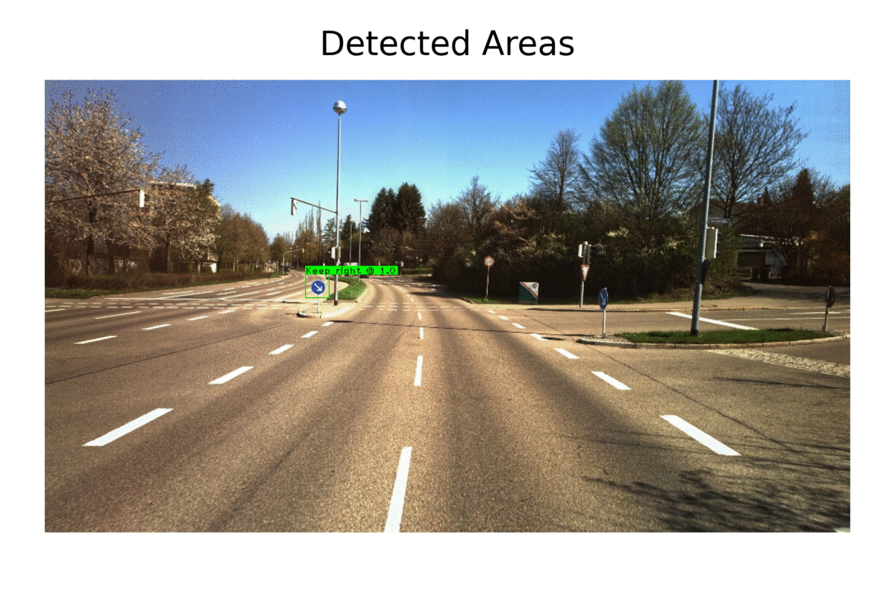

# About
The aim of this project is to find areas in an image that might show traffic-signs. In a next stage, these areas are cut-out and classified by a convolutional neural network trained on a modified version of the GTSRB-Dataset. For the preceding detection, OpenCV was used.

# Legal notice
Generally speaking, the absence of a license means that the default copyright laws apply. This means that all rights to the source code remains by its owner and that nobody else may reproduce, distribute, or create derivative works from this work.

